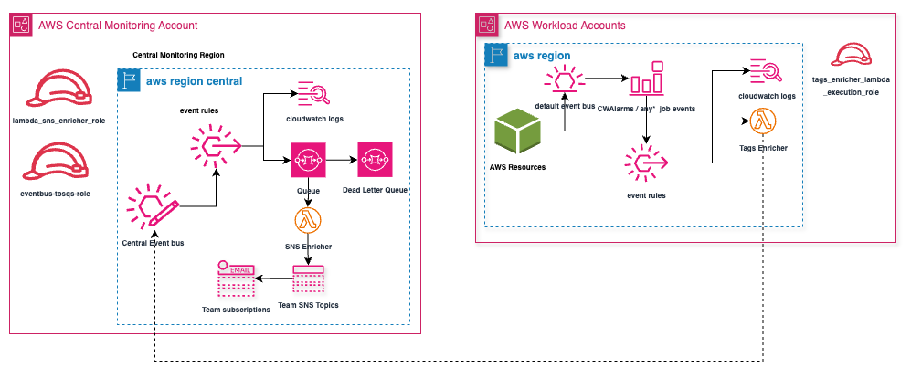

# AWS Centralized Alerts Terraform Module

[](https://github.com/aws/mit-0)
[](https://www.terraform.io/)
[](https://registry.terraform.io/providers/hashicorp/aws/latest)

An IAC code repo with Terraform and Cloudformation for implementing a centralized alerting solution across multiple AWS accounts.

## Overview

This solution centralizes CloudWatch alarms and event notifications from multiple AWS accounts into a single monitoring account using EventBridge, Lambda, SQS, and SNS. It enriches alerts with resource tags and routes them to appropriate teams based on configurable rules.

## Architecture



### Components

**Central Monitoring Account:**
- Central Event Bus receives events from all workload accounts
- Event Rules filter and route events based on patterns to appropriate targets
- SQS Queue buffers events with Dead Letter Queue for error handling
- SNS Enricher Lambda processes events and routes to team-specific SNS topics
- Team SNS Topics distribute notifications via email subscriptions

**Workload Accounts:**
- Default Event Bus captures events from AWS resources
- Event Rules filter relevant events pertaining to the AWS service it relates to.
- Tags Enricher Lambda adds resource tag information before forwarding.

## Event Flow

1. Events are generated in workload accounts (CloudWatch alarms, EC2 state changes)
2. Event rules filter and forward events to the Tags Enricher Lambda.
3. The Lambda enriches events with resource tags and forwards to the central event bus.
4. Central account event bus routes events to CloudWatch Logs and SQS queue.
5. SNS Enricher Lambda processes events from queue and determines appropriate team SNS topic.
6. Notifications are sent to team members via email subscriptions.

## Benefits

- Centralized monitoring across your AWS organization
- Tag-based alert routing to appropriate teams
- Context-rich notifications with resource information
- Scalable architecture with error handling
- Fully automated deployment with IaC

## Prerequisites

- A foundational understanding of how to utilize Terraform and CloudFormation.
- AWS Organizations with central monitoring and workload accounts.
- Terraform v1.8.5+
- AWS CLI with appropriate permissions.
- IAM permissions for both central and workload accounts.


## Deployment

### Central Account Deployment

1. Navigate to the central-monitoring-account directory:
   ```bash
   cd terraform-aws-centralalerts/central-monitoring-account
   ```

2. Copy the example configuration file:
   ```bash
   cp ../example.auto.tfvars .
   ```

3. Edit the auto.tfvars file to replace placeholders with your actual values. The example file includes:

   ```hcl
   # Region and EventBridge bus configuration
   central_cwalarms_region = "eu-west-2"
   central_cwalarms_busname = "central_cwalarms_bus"
   central_cwalarms_eventtarget_role = "eventbridge_tosqs_role"

   # Resource naming
   central_cwalarms_eventbus_rule = "cwalarms_enriched"
   central_cwalarms_loggroup_name = "cwalarms_enriched"
   central_cwalarms_kms_alias = "alias/kms_cwalarms"
   central_cwarlams_sqs_name = "cwalarms_queue"
   central_cwalarm_deadletter_queue_name = "central_cwalarm_deadletter"

   # Lambda configuration
   sns_enricher_lambda_name = "cwalarms_sns_enricher"
   sns_enricher_lambda_role = "cwalarms_sns_enricher_role"
   timeout = 15
   memory_size = 128
   lambda_concurrent_executions = 50

   # Team routing configuration
   filter_data = {
     "default" = {
       Topic             = "default-alerts-topic"
       sns_subscriptions = ["user1@example.com", "user2@example.com"]
       Tags = {
         Key   = ["Name"],
         Value = ["default"]
       }
     }
     "team-rule1" = {
       Topic             = "mytopic"
       sns_subscriptions = ["team1-user1@example.com", "team1-user2@example.com"]
       Tags = {
         Key   = ["Namespace", "Name"],
         Value = ["app831test", "app831test_SINGLE_AZ_1"]
       }
     }
   }
   ```

   Key areas to customize:
   - Replace email addresses with your team's actual addresses
   - Update S3 bucket name for code signing (`code_signing_bucket_name`)
   - Customize team routing rules in `filter_data` based on your tagging strategy
   - Adjust resource tags to match your organization's standards

4. Deploy with Terraform:
   ```bash
   terraform init
   terraform plan
   terraform apply
   ```

### Workload Account Deployment

For each workload account:

1. Deploy IAM role template:
   ```bash
   aws cloudformation deploy \
     --template-file workload-accounts/cfn-cwalarms-tocentralbus-workloads-role.yml \
     --stack-name central-alerts-role \
     --capabilities CAPABILITY_NAMED_IAM \
     --parameter-overrides \
       pCentralEventBusName=central_cwalarms_bus \
       pCentralAccountId=YOUR_CENTRAL_ACCOUNT_ID \
       pCentralEventBusRegion=eu-west-2
   ```

2. Deploy event rules and Lambda function:
   ```bash
   aws cloudformation deploy \
     --template-file workload-accounts/cfn-cwalarms-tocentralbus-workloads-rules.yml \
     --stack-name central-alerts-rules \
     --capabilities CAPABILITY_IAM \
     --parameter-overrides \
       pCentralEventBusName=central_cwalarms_bus \
       pCentralAccountId=YOUR_CENTRAL_ACCOUNT_ID \
       pCentralEventBusRegion=eu-west-2
   ```

3. (Optional) Deploy custom event rules to capture additional event types:
   ```bash
   aws cloudformation deploy \
     --template-file workload-accounts/cfn-alerts-tocentralbus-workload-custom.yml \
     --stack-name central-alerts-custom-events \
     --capabilities CAPABILITY_IAM \
     --parameter-overrides \
       pEventRuleName=custom-events-rule \
       pEventPattern="{\"source\": [\"aws.s3\"],\"detail-type\": [\"Object Created\"]}"
   ```

   See the "Adding New Event Types" section for more details on event patterns.

## Customization

### Adding New Event Types

The solution handles CloudWatch Alarm and EC2 state changes by default. To add support for additional event types:

1. Configure workload accounts to capture the new event types by deploying custom event rules:

```bash
aws cloudformation deploy \
  --template-file workload-accounts/cfn-alerts-tocentralbus-workload-custom.yml \
  --stack-name central-alerts-custom-events \
  --capabilities CAPABILITY_IAM \
  --parameter-overrides \
    pEventRuleName=custom-events-rule \
    pEventPattern="{\"source\": [\"aws.s3\"], \"detail-type\": [\"Object Created\"]}"
```

### Enhancing Event Processing

The solution processes events in two stages:

1. **Workload Account (Tags Enricher)**: Extracts resource IDs from events, fetches resource tags, and enriches events before forwarding to the central account
2. **Central Account (SNS Enricher)**: Routes the pre-enriched events to appropriate team SNS topics based on the tags

#### Adding Support for New Event Types in Workload Accounts

To support new event types, you need to modify the Tags Enricher Lambda in the workload accounts:

1. Edit the Lambda function code in the CloudFormation template (`workload-accounts/cfn-cwalarms-tocentralbus-workloads-rules.yml`):

```python
# Find the resource_type and resource_id based on event type
if event_type == "S3 Object Created":
    # Extract S3 bucket and object information
    resource_type = "s3"
    bucket_name = event['detail']['bucket']['name']
    resource_id = f"arn:aws:s3:::{bucket_name}"
    monitored_resources.append(resource_id)
```

2. Deploy the updated CloudFormation template to all workload accounts:

```bash
aws cloudformation deploy \
  --template-file workload-accounts/cfn-cwalarms-tocentralbus-workloads-rules.yml \
  --stack-name central-alerts-rules \
  --capabilities CAPABILITY_IAM
```

#### Adding Support for New Event Types in Central Account

To process the enriched events in the central account, add a handler to the SNS Enricher Lambda:

1. Create a new handler file in the `central-monitoring-account/function/enrichers/` directory:

```python
# Example: central-monitoring-account/function/enrichers/s3_events.py
def s3_events_handler(message_body):
    """Handler for S3 event notifications"""
    # The event is already enriched with resource tags from the workload account
    # Just format the notification message

    # Extract information from the enriched event
    bucket_name = message_body["detail"]["detail"]["bucket"]["name"]
    object_key = message_body["detail"]["detail"]["object"]["key"]

    # Get resource tags that were added by the workload account
    resource_tags = message_body["detail"]["enriched"]["resource_tags"]

    subject = f"S3 Event: {message_body['detail']['detail-type']}"

    message = "Greetings from S3 Events notifier ! \n \n"
    message += f"S3 Event: {message_body['detail']['detail-type']} \n \n"
    message += "Details:- \n \n"
    message += f"Account:      {message_body['detail']['account']} \n"
    message += f"Region:       {message_body['detail']['region']} \n"
    message += f"Bucket:       {bucket_name} \n"
    message += f"Object:       {object_key} \n"
    message += f"Resource Tags: {resource_tags} \n"

    return subject, message
```

2. Update the `lambda_handler.py` file to include your new handler:

```python
# Add import at the top
from enrichers.s3_events import s3_events_handler

# Add condition in lambda_handler function
elif event_type == "S3 Object Created" or event_type == "S3 Object Removed":
    subject, message = s3_events_handler(message_body)
```

The `pEventPattern` parameter defines which events to capture using EventBridge pattern syntax. Here are some examples with more detailed patterns:

- S3 object creation events:
  ```json
  {
    "source": ["aws.s3"],
    "detail-type": ["Object Created"],
    "detail": {
      "bucket": {
        "name": ["my-important-bucket"]
      },
      "object": {
        "key": [{
          "prefix": "backups/"
        }]
      }
    }
  }
  ```

- EC2 instance state changes with specific instance types:
  ```json
  {
    "source": ["aws.ec2"],
    "detail-type": ["EC2 Instance State-change Notification"],
    "detail": {
      "state": ["stopped", "terminated"],
      "instance-type": ["t2.micro", "t3.small"]
    }
  }
  ```

- CloudWatch Alarms for specific severity:
  ```json
  {
    "source": ["aws.cloudwatch"],
    "detail-type": ["CloudWatch Alarm State Change"],
    "detail": {
      "alarmName": [{
        "prefix": "Critical-"
      }],
      "state": {
        "value": ["ALARM"]
      }
    }
  }
  ```

- Custom application events with filtering:
  ```json
  {
    "source": ["custom.myapp"],
    "detail-type": ["UserActivity"],
    "detail": {
      "actionType": ["login", "logout"],
      "userType": ["admin"],
      "region": ["us-east-1", "eu-west-1"]
    }
  }
  ```

Each event type may require a corresponding handler in the enricher Lambda to properly process and route the notifications.

### Adding Team Routing Rules

Update the `filter_data` variable in your tfvars file:
```hcl
"new-team" = {
  Topic             = "new-team-topic"
  sns_subscriptions = ["new-team@example.com"]
  Tags = {
    Key   = ["Department", "Environment"],
    Value = ["Engineering", "Production"]
  }
}
```

## Static Code Findings

The following static analysis warnings are intentionally ignored as they are low-impact and required by design.

* **W28** (Line 46, `cfn-cwalarms-tocentralbus-workloads-role.yml`): Explicit IAM role naming for consistency
* **W11** (Line 46, `cfn-cwalarms-tocentralbus-workloads-role.yml`): Wildcards required to read resource tags
* **W89** (Line 155, `cfn-cwalarms-tocentralbus-workloads-rules.yml`): Lambda in VPC not required for AWS service access
* **W58** (Line 155, `cfn-cwalarms-tocentralbus-workloads-rules.yml`): CloudWatch Logs permissions handled by execution role

## Authors

- [Prabhu Kanakamedala](https://github.com/klprabhu)
- [Cheriyan Mundapuzha](https://github.com/jmcherian)

## License

MIT No Attribution

Copyright Amazon.com, Inc. or its affiliates. All Rights Reserved.

Permission is hereby granted, free of charge, to any person obtaining a copy of this software and associated documentation files (the "Software"), to deal in the Software without restriction, including without limitation the rights to use, copy, modify, merge, publish, distribute, sublicense, and/or sell copies of the Software, and to permit persons to whom the Software is furnished to do so.

THE SOFTWARE IS PROVIDED "AS IS", WITHOUT WARRANTY OF ANY KIND, EXPRESS OR IMPLIED, INCLUDING BUT NOT LIMITED TO THE WARRANTIES OF MERCHANTABILITY, FITNESS FOR A PARTICULAR PURPOSE AND NONINFRINGEMENT. IN NO EVENT SHALL THE AUTHORS OR COPYRIGHT HOLDERS BE LIABLE FOR ANY CLAIM, DAMAGES OR OTHER LIABILITY, WHETHER IN AN ACTION OF CONTRACT, TORT OR OTHERWISE, ARISING FROM, OUT OF OR IN CONNECTION WITH THE SOFTWARE OR THE USE OR OTHER DEALINGS IN THE SOFTWARE.
